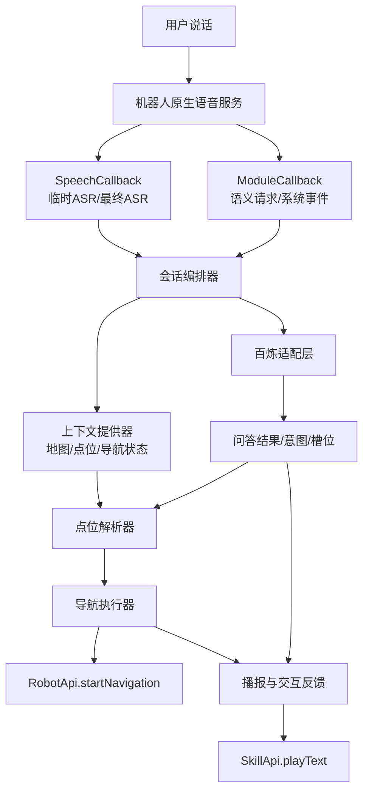
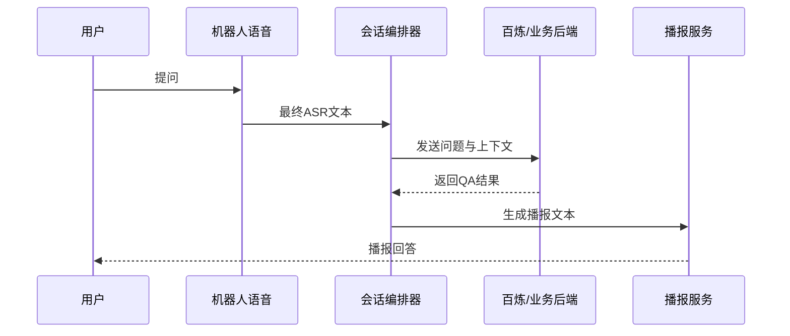
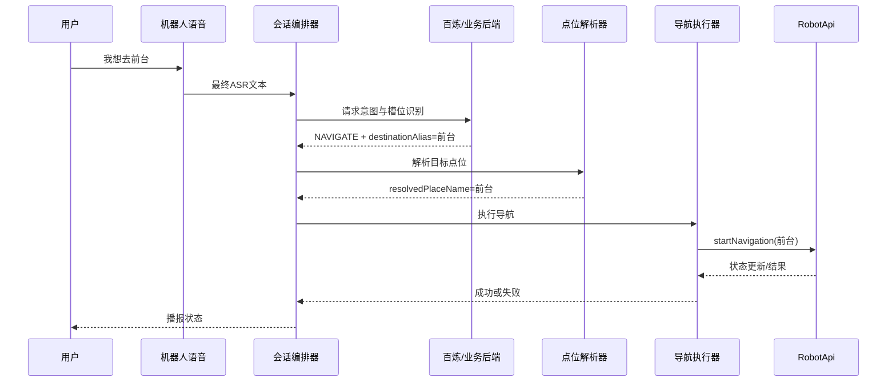

# 百炼实时语音问答与导航技术方案

## 1. 文档目标
本文档面向 `RobotSample` 项目的后续研发落地，设计一套“基于百炼大模型的实时语音问答 + 根据用户目的地执行机器人导航”的技术方案。文档重点回答以下问题：

- 在现有机器人原生 APK 示例工程上，哪些能力可以直接复用。
- 百炼与机器人 SDK 应如何分工，才能在首版尽快落地并控制风险。
- 用户说“我想去会议室”“带我去前台”这类指令后，系统如何完成识别、理解、点位映射和导航执行。
- 首版应如何分期、验证和规避 API Key、弱网、误识别、点位歧义等风险。

本文档不直接修改现有业务代码，而是作为后续实现阶段的设计基线。

## 2. 背景与需求范围
当前 `RobotSample` 已经具备机器人原生语音、导航、地图与点位管理能力，但仍是 SDK 能力演示工程，尚未形成“语音问答到导航执行”的完整业务闭环。本次目标是在该工程基础上，补齐以下能力：

- 用户通过语音与机器人进行自然问答。
- 当用户表达“想去哪里”时，系统能识别其导航意图。
- 系统将自然语言目的地映射到当前地图中的真实点位名。
- 机器人播报确认后执行导航，并在过程里处理打断、失败、歧义与异常。

本次方案默认以首版可落地为原则，先完成稳定闭环，再逐步增强实时性与多轮能力。

### 2.1 本次目标
- 实现持续拾音场景下的自然语言问答。
- 支持导航意图识别与点位槽位抽取。
- 支持从当前地图点位列表中解析目标点并发起导航。
- 支持播报、澄清、取消、重新导航和失败兜底。
- 支持 PoC 到 Beta 的分期落地。

### 2.2 非目标
- 暂不覆盖视觉问答、图像理解、视频通话。
- 暂不覆盖多机器人协同调度。
- 暂不覆盖跨地图任务编排。
- 暂不将整套音频链路在首版完全切换为百炼原生实时语音 SDK。

## 3. 现状基线与可复用能力

### 3.1 现有工程中的关键接入点
当前项目已经提供了首版落地所需的大部分机器人侧能力接入点：

- `app/src/main/java/com/ainirobot/robotos/application/RobotOSApplication.java`
  - 负责连接 `RobotApi` 与 `SkillApi`。
  - 是注册机器人底层回调和语音回调的统一入口。
- `app/src/main/java/com/ainirobot/robotos/application/SpeechCallback.java`
  - 已能接收临时 ASR 结果、最终 ASR 结果、识别开始/结束等事件。
- `app/src/main/java/com/ainirobot/robotos/application/ModuleCallback.java`
  - 已能接收系统下发的语音/NLP 请求，是扩展会话编排的重要入口。
- `app/src/main/java/com/ainirobot/robotos/fragment/SpeechFragment.java`
  - 演示了 `SkillApi.playText()`、`stopTTS()`、`queryByText()` 的用法。
- `app/src/main/java/com/ainirobot/robotos/fragment/NavigationFragment.java`
  - 演示了 `startNavigation()`、`stopNavigation()`、`resumeSpecialPlaceTheta()` 及主要错误码处理。
- `app/src/main/java/com/ainirobot/robotos/fragment/LocationFragment.java`
  - 演示了定位状态检查、获取当前位置、设置点位和地图信息读取。
- `app/src/main/java/com/ainirobot/robotos/fragment/NavFragment.java`
  - 演示了地图点位读取、地图展示和点击点位后发起导航的逻辑。
- `app/src/main/java/com/ainirobot/robotos/fragment/LeadFragment.java`
  - 演示了获取点位列表和引领/巡航类场景能力，可作为二阶段增强参考。

### 3.2 官方能力基线
结合猎户星空原生 APK 文档与现有代码，可以确认以下事实：

- 机器人原生语音侧支持：
  - 识别开始/结束回调。
  - 临时识别结果与最终识别结果回调。
  - 文本播报与停止播报。
  - 文本触发 NLP 查询。
  - 持续拾音模式配置。
- 机器人导航侧支持：
  - 获取当前地图名称。
  - 获取当前地图点位列表。
  - 根据点位名执行导航。
  - 根据坐标执行导航。
  - 停止导航、转向目标点、获取导航状态与错误码。

### 3.3 与目标能力的缺口
现有工程与目标能力之间主要还缺少以下模块：

- 大模型调用层：当前没有百炼 API 接入。
- 会话编排层：当前没有“ASR -> 意图理解 -> 回复/导航”的统一状态机。
- 点位语义层：当前只有点位读取与手动输入，没有自然语言别名映射。
- 导航业务层：当前只有 Fragment 示例，没有面向业务的统一导航执行封装。
- 异常策略层：当前没有澄清、打断、取消、弱网重试和安全治理。

## 4. 技术路线选型

### 4.1 推荐路线
首版推荐采用“机器人原生语音链路 + 百炼问答与意图理解 + RobotApi 导航执行”的混合架构。

这一路线的核心原则是：

- 继续使用机器人现成的 ASR/TTS、语音服务连接和拾音能力。
- 将最终识别文本送入百炼，完成问答生成与导航意图抽取。
- 应用侧维护一层点位解析器，将自然语言目的地映射为当前地图中的标准点位名。
- 导航执行仍通过 `RobotApi.startNavigation()` 完成。

### 4.2 推荐路线的原因
- 与当前工程贴合度最高，修改面最小。
- 语音能力依赖机器人 ROM 与系统服务，复用原生链路更稳妥。
- 避免首版就承担录音、回声消除、播放打断、WebSocket 音频链路等复杂问题。
- 便于快速验证“问答 + 导航”核心业务价值。
- 后续如果需要更强的实时交互，再平滑演进到百炼全链路实时语音。

### 4.3 备选路线
备选方案是“百炼实时语音 SDK 全链路接入”：

- 客户端自行采集音频并推送给百炼实时多模交互 SDK。
- 百炼完成流式识别、流式回复与语音打断。
- 机器人只保留底盘、地图、导航执行能力。

该方案可作为二阶段演进方向，但不建议作为首版。

### 4.4 不推荐首版直接使用备选路线的原因
- 需要额外处理音频录制、播放、AEC、全双工与弱网重连。
- 对客户端性能和现场噪声环境更敏感。
- 当前工程为 Java + 旧版 Android 工程，直接接入较新的实时语音 SDK 兼容成本更高。
- API Key 与鉴权治理压力更大。

## 5. 总体架构设计

### 5.1 总体架构



### 5.2 模块分层说明

#### 语音接入层
负责承接机器人原生语音回调，输出统一的语音事件：

- 临时识别结果。
- 最终识别结果。
- 开始/结束识别。
- 查询结束。
- 系统语义请求。

#### 会话编排层
负责跨模块控制流程，是整套方案的核心控制器：

- 维护会话 ID 与当前会话状态。
- 决定何时发起百炼请求。
- 决定是执行问答还是导航。
- 在导航中处理新指令、取消和播报打断。

#### 百炼适配层
负责与百炼服务通信：

- 发送用户问题和上下文。
- 返回问答文本、意图分类、目的地槽位、置信度和澄清建议。
- 为 PoC 和正式环境屏蔽鉴权差异。

#### 上下文提供层
负责为大模型和点位解析提供现场上下文：

- 当前地图名。
- 当前地图点位列表。
- 当前定位状态。
- 当前是否正在导航。
- 当前导航目的地。

#### 点位解析层
负责把用户自然语言目的地映射为可执行点位：

- 别名映射。
- 同义词归并。
- 模糊匹配。
- 多候选冲突检测。
- 必要时发起二次澄清。

#### 导航执行层
负责统一调用机器人底盘能力：

- 启动导航。
- 停止导航。
- 处理错误码。
- 反馈导航成功、失败、不可达、未定位等状态。

#### 状态反馈层
负责对用户播报与 UI 状态更新：

- “正在为您前往会议室。”
- “当前有两个会议室，请问您要去哪个？”
- “机器人当前未定位，请先完成定位。”
- “前往该点位失败，请稍后重试。”

## 6. 推荐落地目录
建议在现有工程中新增业务层目录，而不是继续把业务逻辑堆在 Fragment 中。建议目录如下：

- `app/src/main/java/com/ainirobot/robotos/voice/`
  - `RobotSpeechGateway.java`
  - `SpeechEvent.java`
  - `SpeechEventListener.java`
- `app/src/main/java/com/ainirobot/robotos/llm/`
  - `BailianClient.java`
  - `BailianRequest.java`
  - `BailianResponse.java`
  - `IntentType.java`
- `app/src/main/java/com/ainirobot/robotos/orchestrator/`
  - `ConversationOrchestrator.java`
  - `ConversationState.java`
- `app/src/main/java/com/ainirobot/robotos/nav/`
  - `PlaceCatalogProvider.java`
  - `PlaceAliasRegistry.java`
  - `PlaceResolver.java`
  - `NavigationExecutor.java`
- `app/src/main/java/com/ainirobot/robotos/model/`
  - `PlaceCandidate.java`
  - `NavigationDecision.java`
  - `ClarificationQuestion.java`
- `app/src/main/assets/`
  - `place_aliases.json`

以上目录只是建议，不要求一次性全部创建，但后续实现应遵循“语音接入、会话编排、大模型适配、导航执行”分层。

## 7. 与现有工程的挂载点设计

### 7.1 应用初始化挂载点
继续以 `RobotOSApplication.java` 作为机器人服务与语音服务初始化入口，在 `handleApiConnected()` 之后完成以下动作：

- 初始化 `ConversationOrchestrator`。
- 初始化 `BailianClient`。
- 初始化 `PlaceCatalogProvider`。
- 将 `SpeechCallback` 和 `ModuleCallback` 的事件统一转发给会话编排器。

### 7.2 语音回调挂载点
`SpeechCallback.java` 当前已能接收：

- `onStart()`
- `onStop()`
- `onSpeechParResult()`
- `onQueryAsrResult()`
- `onQueryEnded()`

建议其中：

- `onSpeechParResult()` 只用于实时字幕和交互提示，不直接触发大模型。
- `onQueryAsrResult()` 作为首版真正触发问答和导航意图识别的入口。
- `onQueryEnded()` 用于超时、取消和状态收敛。

### 7.3 模块回调挂载点
`ModuleCallback.java` 建议继续保留系统语义请求入口，但不直接写业务逻辑。建议改为：

- 把 `reqType`、`reqText`、`reqParam` 统一封装为领域事件。
- 交由 `ConversationOrchestrator` 做状态判断。

这样可避免机器人系统事件、用户问答与导航指令直接耦合在回调类里。

### 7.4 导航能力挂载点
`NavigationFragment.java` 和 `NavFragment.java` 已经给出了核心调用方式，后续正式业务调用建议统一收敛到 `NavigationExecutor`：

- `startNavigation(destName, coordinateDeviation, timeout, listener)`
- `stopNavigation()`
- `resumeSpecialPlaceTheta()`

这样 Fragment 演示代码与正式业务代码可以并存，不互相污染。

## 8. 核心模块设计

### 8.1 RobotSpeechGateway
职责：

- 接入 `SpeechCallback` 与 `ModuleCallback`。
- 对外发布统一事件模型。
- 屏蔽机器人语音回调的原始细节。

建议事件类型：

- `ASR_PARTIAL`
- `ASR_FINAL`
- `ASR_START`
- `ASR_STOP`
- `QUERY_END`
- `NLP_REQUEST`
- `INTERRUPT`

### 8.2 ConversationOrchestrator
职责：

- 接收语音事件。
- 判断是普通问答、导航、取消还是系统控制。
- 管理当前会话与导航任务的生命周期。
- 编排播报、澄清与导航执行顺序。

建议状态：

- `IDLE`
- `LISTENING`
- `THINKING`
- `SPEAKING`
- `NAVIGATING`
- `CLARIFYING`
- `INTERRUPTED`
- `ERROR`

建议规则：

- 最终 ASR 到达后进入 `THINKING`。
- 百炼返回普通问答时进入 `SPEAKING`。
- 百炼返回导航意图且点位解析成功时进入 `NAVIGATING`。
- 百炼返回多个候选点位时进入 `CLARIFYING`。
- 收到“停止”“取消”“别去了”时，优先执行中断。

### 8.3 BailianClient
职责：

- 组织请求。
- 发起网络调用。
- 解析百炼返回。
- 对调用异常、超时和非预期结果做统一收口。

建议不要让客户端直接面向“自由文本回答”做业务判断，而应让百炼返回结构化结果。首版更推荐两种方式：

- 方式一：客户端请求自建后端，由后端调用百炼并返回结构化 JSON。
- 方式二：PoC 阶段客户端直连百炼，但要求 prompt 约束严格输出 JSON。

正式环境优先方式一。

### 8.4 PlaceCatalogProvider
职责：

- 获取当前地图名。
- 获取当前地图全部点位。
- 检查点位数据是否可用。
- 缓存点位列表并按地图名分桶。

建议刷新时机：

- 应用启动后首次连接机器人服务成功。
- 地图切换后。
- 定位成功后。
- 导航前若缓存过期则重新拉取。

### 8.5 PlaceAliasRegistry
职责：

- 为真实点位维护业务别名。
- 存放会议室、前台、卫生间、展厅、充电点等自然语言称呼。
- 支持同义词和口语化表达。

建议数据源：

- 首版使用 `assets/place_aliases.json` 本地配置。
- 二阶段支持后台下发或远程配置热更新。

示例结构如下：

```json
{
  "会议室A": ["A会议室", "一号会议室", "大会议室"],
  "前台": ["服务台", "接待台"],
  "展厅": ["展示区", "参观区"]
}
```

### 8.6 PlaceResolver
职责：

- 依据百炼返回的目的地槽位、当前地图点位和别名字典进行匹配。
- 给出唯一命中的标准点位名。
- 无命中时给出失败原因。
- 多命中时给出澄清问题。

建议匹配顺序：

1. 与标准点位名完全匹配。
2. 与别名完全匹配。
3. 对标准点位名做包含匹配。
4. 对别名做包含匹配。
5. 触发澄清，不做武断执行。

### 8.7 NavigationExecutor
职责：

- 在调用前确认机器人是否已定位。
- 统一调用 `RobotApi.startNavigation()`。
- 监听导航结果、错误码和状态回调。
- 把机器人底盘错误翻译成对用户友好的中文播报。

建议至少覆盖以下错误：

- 当前未定位。
- 目标点不存在。
- 已在目标点附近。
- 当前底盘资源被占用。
- 避障超时、目标不可达。
- 导航已在执行中。

### 8.8 VoiceFeedbackService
职责：

- 统一做 TTS 播报。
- 在新一轮交互开始时按策略打断旧播报。
- 将导航状态与问答状态转成口语化反馈。

建议策略：

- 导航前播报一次确认。
- 长回答做截断或摘要。
- 导航执行中避免过密播报。

## 9. 百炼接口设计

### 9.1 鉴权策略
不建议把长期有效的百炼 API Key 直接硬编码进 APK。推荐顺序如下：

1. 正式环境：服务端代理调用百炼，客户端只拿业务接口。
2. 次优方案：服务端签发短时 Token，客户端携带短时凭证访问。
3. PoC 方案：临时沿用此前摄像头项目中的百炼 Key 或服务端配置，但必须在文档中明确这是验证方案，不可直接用于生产。

### 9.2 请求模型
推荐客户端向业务后端发送结构化请求，由后端再调用百炼。建议请求体如下：

```json
{
  "sessionId": "8d4d4d78-9f0e-4c85-bb9d-8d1f4c6e5d20",
  "traceId": "20260423-robot-001",
  "inputText": "我想去会议室",
  "scene": "robot_navigation_assistant",
  "robotContext": {
    "mapName": "一层地图",
    "isEstimated": true,
    "isNavigating": false,
    "currentDestination": "",
    "candidatePlaces": ["前台", "会议室A", "会议室B", "展厅"]
  }
}
```

### 9.3 返回模型
建议后端约束百炼输出为固定结构：

```json
{
  "replyText": "可以，我带您去会议室。请问您要去A会议室还是B会议室？",
  "intent": {
    "type": "NAVIGATE",
    "confidence": 0.92
  },
  "navigation": {
    "shouldNavigate": false,
    "destinationAlias": "会议室",
    "resolvedPlaceName": "",
    "needClarification": true,
    "clarificationOptions": ["会议室A", "会议室B"]
  },
  "conversation": {
    "shouldInterruptCurrentSpeech": true,
    "shouldStopCurrentNavigation": false
  }
}
```

### 9.4 意图类型建议
建议至少定义如下意图：

- `QA`
- `NAVIGATE`
- `STOP_NAVIGATION`
- `CANCEL`
- `UNKNOWN`

必要时可扩展：

- `REPEAT`
- `ASK_CURRENT_LOCATION`
- `ASK_NAVIGATION_STATUS`

## 10. 点位语义设计

### 10.1 点位命名原则
建议将机器人地图中的真实点位名视为唯一执行名，而自然语言只是这些执行名的别名层。换言之：

- 真正传给 `RobotApi.startNavigation()` 的一定是标准点位名。
- 百炼和用户说法可以是口语化目的地。
- 业务层必须完成“口语表达 -> 标准点位”的收敛。

### 10.2 澄清策略
以下情况必须澄清，不应直接导航：

- 一个别名命中多个点位。
- 用户只说了“会议室”“办公室”“洗手间”这类泛称。
- 当前地图没有明确同名点位。
- 当前地图与用户目标可能不在同一楼层或不同区域。

示例：

- 用户：“带我去会议室。”
- 系统：“当前有两个会议室，分别是 A 会议室和 B 会议室，请问您要去哪个？”

### 10.3 失败策略
以下情况直接失败并反馈：

- 当前地图未配置任何候选点位。
- 机器人未定位。
- 点位确实不存在。
- 百炼返回结构不合法。

## 11. 关键流程设计

### 11.1 普通问答流程



### 11.2 导航流程



### 11.3 导航歧义流程
- 用户说“带我去会议室”。
- 百炼识别意图为 `NAVIGATE`，槽位为“会议室”。
- 点位解析器发现 `会议室A`、`会议室B` 都匹配。
- 会话进入 `CLARIFYING` 状态。
- 机器人播报澄清问题。
- 用户给出明确答案后，再次走点位解析并启动导航。

### 11.4 取消与打断流程
建议定义统一优先级：

1. 停止类指令：如“停止导航”“别去了”“停下来”。
2. 新导航指令：如“改去前台”。
3. 普通问答打断播报。
4. 导航中的普通问答。

推荐策略：

- 若当前正在导航，且用户发出新的导航目标，先询问是否取消当前导航并切换。
- 若当前仅在播报问答内容，则收到新问题时可直接打断旧播报。
- 若收到停止类指令，则立即 `stopNavigation()` 并 `stopTTS()`。

## 12. 实时性策略

### 12.1 首版实时定义
首版不追求端到端全双工音频，而采用“持续拾音 + 最终 ASR 触发 + 快速返回”的务实方案。这里的“实时”主要体现在：

- 机器人持续监听用户语音。
- 最终 ASR 一旦返回即立刻发起模型判断。
- 文本播报支持被新问题中断。
- 导航过程支持被取消和重定向。

### 12.2 首版建议
- 优先使用最终 ASR 结果触发大模型。
- 临时 ASR 结果只用于字幕和等待提示。
- 对长回答做摘要，避免播报过长影响交互节奏。

### 12.3 二阶段增强
在设备版本和业务节奏允许的情况下，可增强为：

- 百炼流式响应。
- 先播报首句，再继续补全后续答案。
- 导航状态和问答融合播报。
- 更细的用户打断策略。

## 13. 导航执行策略

### 13.1 调用前检查
每次导航前必须检查：

- `isRobotEstimate` 是否为真。
- 当前地图是否已获取成功。
- 目标点位是否存在于当前地图。
- 当前底盘资源是否可用。

### 13.2 推荐参数
结合当前示例工程和官方建议，首版可采用保守参数：

- `coordinateDeviation = 0.5 ~ 1.5`
- `time = 10000 ~ 30000 ms`

示例工程当前使用：

```java
RobotApi.getInstance().startNavigation(0, placeName, 1.5, 10 * 1000, listener);
```

正式业务可根据实际地图和避障情况再调优。

### 13.3 错误码到播报文案映射
建议在 `NavigationExecutor` 内统一维护中文反馈：

- `ERROR_NOT_ESTIMATE` -> “机器人当前未定位，请先完成定位。”
- `ERROR_DESTINATION_NOT_EXIST` -> “当前地图中没有这个目的地。”
- `ERROR_IN_DESTINATION` -> “机器人已经在目标点附近。”
- `ERROR_DESTINATION_CAN_NOT_ARRAIVE` -> “前往目标点失败，可能被障碍物阻挡。”
- `ACTION_RESPONSE_ALREADY_RUN` -> “已有导航任务正在执行。”
- `ACTION_RESPONSE_REQUEST_RES_ERROR` -> “当前底盘正被其他任务占用。”

## 14. 安全与运维设计

### 14.1 API Key 安全
- 不在客户端明文保存长期 Key。
- 正式环境建议全部由服务端代调用百炼。
- 若沿用此前摄像头项目中的百炼配置，应沿用该项目已有的密钥管理机制，而不是再次散落到 APK 中。

### 14.2 日志与观测
建议每轮会话至少记录：

- `traceId`
- `sessionId`
- 原始 ASR 文本
- 意图类型
- 点位解析结果
- 导航开始时间
- 导航结束时间
- 导航错误码
- 百炼响应耗时

这样便于排查“识别对了但没导航”“点位命中错误”“弱网响应慢”等问题。

### 14.3 隐私与合规
- 用户语音文本属于潜在敏感信息，日志中应避免长期保留完整会话。
- 如需上传日志到服务端，建议做脱敏或设置保留期限。

## 15. 风险与前置条件

### 15.1 设备与系统前提
- 机器人必须已完成建图和定位。
- 当前地图中必须有可导航点位。
- 目标机型与 ROM 版本必须支持当前所用导航与语音 API。

### 15.2 业务风险
- 点位命名不规范会直接影响意图命中率。
- 用户口语表达差异大，必须依赖别名字典和澄清策略。
- 导航与底盘资源互斥，不能与其他底盘动作无序并发。

### 15.3 技术风险
- 旧版 Android 工程与新 SDK 的兼容性风险。
- 弱网导致百炼超时或回复慢。
- 机器人现场噪声导致 ASR 偏差。
- 长回答影响交互节奏。

### 15.4 讨论资料风险
给出的技术讨论链接当前没有可用转写内容，因此本方案仅将其视为背景来源，不把它作为具体技术结论依据。

## 16. 分期实施建议

### 16.1 Phase 1：PoC
目标是打通最小闭环：

- 接收最终 ASR。
- 将文本发送到百炼或业务后端。
- 返回问答文本并播报。
- 支持一个或少量固定点位的导航闭环。

验收标准：

- 用户能通过语音提问并得到回答。
- 用户说“去前台”时能成功导航到指定点位。

### 16.2 Phase 2：Alpha
目标是扩展业务可用性：

- 引入完整点位列表同步。
- 引入别名字典和多候选澄清。
- 支持取消导航和重新导航。
- 支持导航状态播报与失败兜底。

验收标准：

- 多个目的地可稳定识别。
- 多点位歧义能通过追问解决。
- 失败场景具备可理解反馈。

### 16.3 Phase 3：Beta
目标是提升交互体验：

- 支持流式问答体验。
- 支持更细粒度打断。
- 支持远程别名配置。
- 支持更完善的日志和监控。

验收标准：

- 用户对话等待感明显下降。
- 打断和重定向体验自然。
- 核心指标可观测。

## 17. 测试与验收建议

### 17.1 功能测试
- 普通问答。
- 去指定点位。
- 去不存在点位。
- 去歧义点位。
- 导航中取消。
- 导航中改目的地。
- 导航中普通问答。

### 17.2 异常测试
- 机器人未定位。
- 当前地图为空。
- 点位列表获取失败。
- 百炼接口超时。
- 百炼返回非法 JSON。
- 当前底盘资源被其他动作占用。

### 17.3 体验测试
- 长回答是否过长。
- 打断是否自然。
- 澄清问题是否清楚。
- 语音与导航反馈是否一致。

## 18. 结论
对于当前 `RobotSample` 工程，首版最合理的实现路径不是立即把整条语音链路完全切到百炼，而是先复用机器人原生语音与导航能力，在应用层新增会话编排、百炼适配和点位语义解析三层能力，快速完成“能问、能答、能带路”的闭环。

这条路线的核心优势在于：

- 技术改造面较小。
- 与现有示例工程耦合最少。
- 现场稳定性更容易保障。
- 后续仍能平滑演进到更强的流式语音体验。

## 19. 参考资料
- [猎户星空原生开发(APK)文档](https://doc.orionstar.com/blog/knowledge-base-category/android_apk/)
- [猎户星空语音文档](https://doc.orionstar.com/blog/knowledge-base/%e8%af%ad%e9%9f%b3/)
- [猎户星空地图及位置文档](https://doc.orionstar.com/blog/knowledge-base/%e5%9c%b0%e5%9b%be%e5%8f%8a%e4%bd%8d%e7%bd%ae/)
- [猎户星空导航文档](https://doc.orionstar.com/blog/knowledge-base/%E5%AF%BC%E8%88%AA/)
- [猎户星空语音大模型数据返回文档](https://doc.orionstar.com/blog/knowledge-base/%e8%af%ad%e9%9f%b3%e5%a4%a7%e6%a8%a1%e5%9e%8b%e6%95%b0%e6%8d%ae%e8%bf%94%e5%9b%9e%e5%a4%84%e7%90%86/)
- [阿里云百炼 Android 实时多模交互 SDK](https://help.aliyun.com/zh/model-studio/multimodal-sdk-android)
